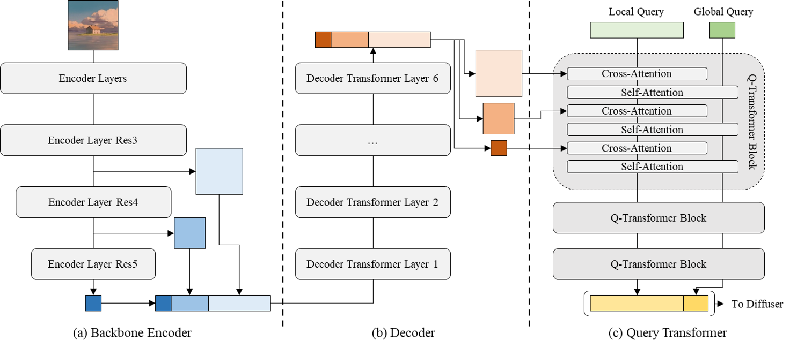

# Prompt-Free Diffusion

[](https://huggingface.co/spaces/shi-labs/Prompt-Free-Diffusion)
[](https://pytorch.org/)
[](https://opensource.org/licenses/MIT)

This repo hosts the official implementation of:

[Xingqian Xu](https://ifp-uiuc.github.io/), Jiayi Guo, Zhangyang Wang, Gao Huang, Irfan Essa, and [Humphrey Shi](https://www.humphreyshi.com/home), **Prompt-Free Diffusion: Taking "Text" out of Text-to-Image Diffusion Models**, [Paper arXiv Link](https://arxiv.org/abs/2305.16223).

## News

- **[2023.06.20]: SDWebUI plugin is created, repo at this [link](https://github.com/xingqian2018/sd-webui-prompt-free-diffusion)**
- [2023.05.25]: Our demo is running on [HuggingFace🤗](https://huggingface.co/spaces/shi-labs/Prompt-Free-Diffusion)
- [2023.05.25]: Repo created

## Introduction

**Prompt-Free Diffusion** is a diffusion model that relys on only visual inputs to generate new images, handled by **Semantic Context Encoder (SeeCoder)** by substituting the commonly used CLIP-based text encoder. SeeCoder is **reusable to most public T2I models as well as adaptive layers** like ControlNet, LoRA, T2I-Adapter, etc. Just drop in and play!

<p align="center">
  
</p>

## Performance

<p align="center">
  
</p>

## Network

<p align="center">
  
</p>

<p align="center">
  
</p>

## Setup

```
conda create -n prompt-free-diffusion python=3.10
conda activate prompt-free-diffusion
pip install torch==2.0.0+cu117 torchvision==0.15.1 --extra-index-url https://download.pytorch.org/whl/cu117
pip install -r requirements.txt
```

## Demo

We provide a WebUI empowered by [Gradio](https://github.com/gradio-app/gradio). Start the WebUI with the following command:

```
python app.py
```

## Pretrained models

To support the full functionality of our demo. You need the following models located in these paths:

```
└── pretrained
    ├── pfd
    |   ├── vae
    |   │   └── sd-v2-0-base-autokl.pth
    |   ├── diffuser
    |   │   ├── AbyssOrangeMix-v2.safetensors
    |   │   ├── AbyssOrangeMix-v3.safetensors
    |   │   ├── Anything-v4.safetensors
    |   │   ├── Deliberate-v2-0.safetensors
    |   │   ├── OpenJouney-v4.safetensors
    |   │   ├── RealisticVision-v2-0.safetensors
    |   │   └── SD-v1-5.safetensors
    |   └── seecoder
    |       ├── seecoder-v1-0.safetensors
    |       ├── seecoder-pa-v1-0.safetensors
    |       └── seecoder-anime-v1-0.safetensors
    └── controlnet
        ├── control_sd15_canny_slimmed.safetensors
        ├── control_sd15_depth_slimmed.safetensors
        ├── control_sd15_hed_slimmed.safetensors
        ├── control_sd15_mlsd_slimmed.safetensors
        ├── control_sd15_normal_slimmed.safetensors
        ├── control_sd15_openpose_slimmed.safetensors
        ├── control_sd15_scribble_slimmed.safetensors
        ├── control_sd15_seg_slimmed.safetensors
        ├── control_v11p_sd15_canny_slimmed.safetensors
        ├── control_v11p_sd15_lineart_slimmed.safetensors
        ├── control_v11p_sd15_mlsd_slimmed.safetensors
        ├── control_v11p_sd15_openpose_slimmed.safetensors
        ├── control_v11p_sd15s2_lineart_anime_slimmed.safetensors
        ├── control_v11p_sd15_softedge_slimmed.safetensors
        └── preprocess
            ├── hed
            │   └── ControlNetHED.pth
            ├── midas
            │   └── dpt_hybrid-midas-501f0c75.pt
            ├── mlsd
            │   └── mlsd_large_512_fp32.pth
            ├── openpose
            │   ├── body_pose_model.pth
            │   ├── facenet.pth
            │   └── hand_pose_model.pth
            └── pidinet
                └── table5_pidinet.pth
```

All models can be downloaded at [HuggingFace link](https://huggingface.co/shi-labs/prompt-free-diffusion).

## Tools

We also provide tools to convert pretrained models from sdwebui and diffuser library to this codebase, please modify the following files:

```
└── tools
    ├── get_controlnet.py
    └── model_conversion.pth
```

You are expected to do some customized coding to make it work (i.e. changing hardcoded input output file paths)

## Performance Anime

<p align="center">
  
</p>

## Citation

```
@article{xu2023prompt,
  title={Prompt-Free Diffusion: Taking" Text" out of Text-to-Image Diffusion Models},
  author={Xu, Xingqian and Guo, Jiayi and Wang, Zhangyang and Huang, Gao and Essa, Irfan and Shi, Humphrey},
  journal={arXiv preprint arXiv:2305.16223},
  year={2023}
}
```

## Acknowledgement

Part of the codes reorganizes/reimplements code from the following repositories: [Versatile Diffusion official Github](https://github.com/SHI-Labs/Versatile-Diffusion) and [ControlNet sdwebui Github](https://github.com/Mikubill/sd-webui-controlnet), which are also great influenced by [LDM official Github](https://github.com/CompVis/latent-diffusion) and [DDPM official Github](https://github.com/lucidrains/denoising-diffusion-pytorch)
